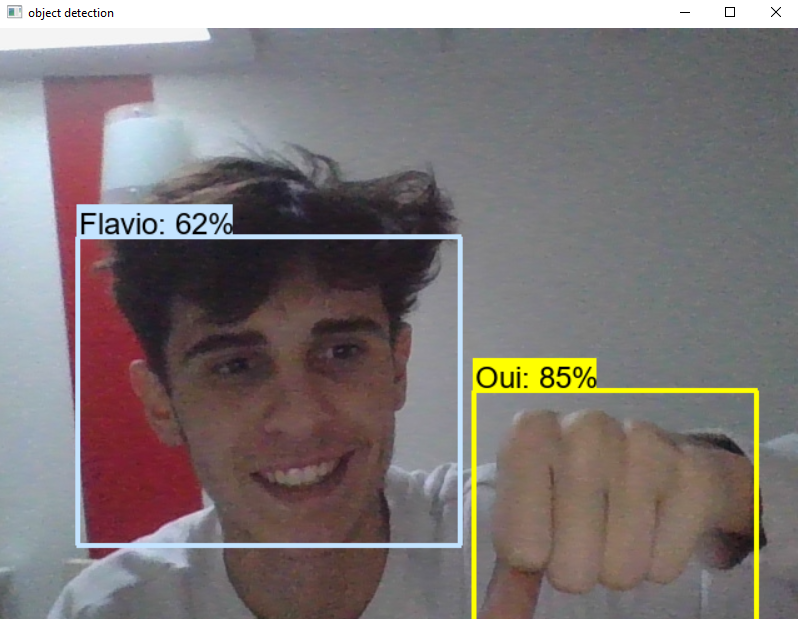
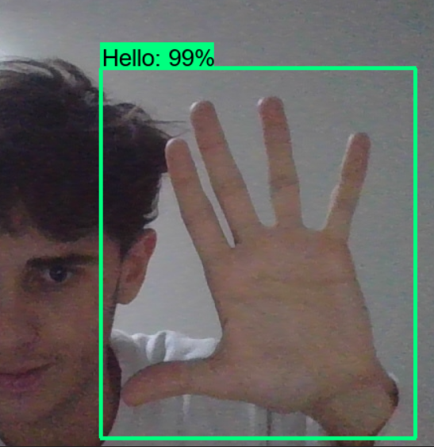

## TensorFlow Object Detection
Ce programme utilise TensorFlow pour détecter des objets a travers une caméra.

## Prérequis
TensorFlow 2.x
OpenCV
Numpy
Installation

# Pour installer ce programme, suivez les étapes suivantes :

Téléchargez et installez TensorFlow 2.x en suivant les instructions du site officiel.
Installez OpenCV en utilisant la commande pip install opencv-python.
Installez Numpy en utilisant la commande pip install numpy.

# Exemple :

[]
[]
